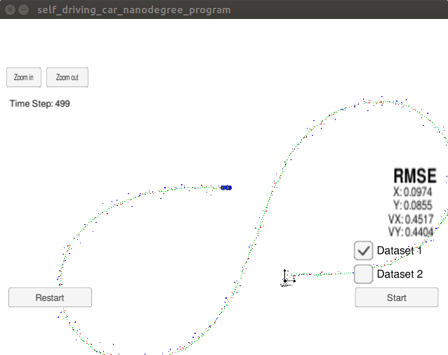

# Extended Kalman Filter Project
Self-Driving Car Engineer Nanodegree Program

In this project a kalman filter is implemented in C++ to estimate the state of a moving object of interest with noisy lidar and radar measurements. Passing the project requires obtaining RMSE values that are lower that the tolerance outlined in the project rubric [.11, .11, 0.52, 0.52]. 

The result of the KF at the end of running through dataset1 is shown below

